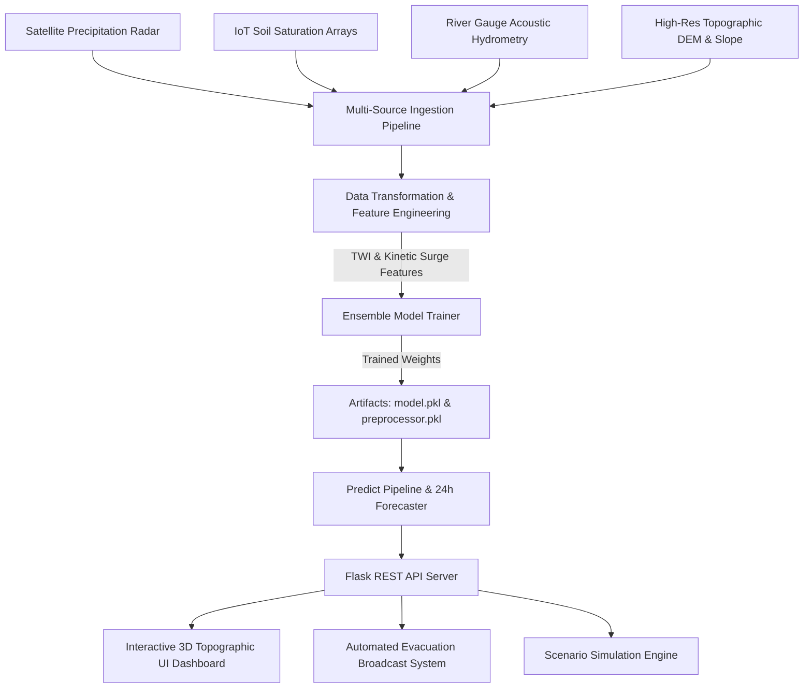

# Flash Flood Prediction System for Hilly Regions using Multi-Source Data

[](https://www.python.org/downloads/)
[](https://opensource.org/licenses/MIT)
[](https://flask.palletsprojects.com/)
[](https://xgboost.readthedocs.io/)

An end-to-end, enterprise-grade Machine Learning and Dynamic Real-Time Hydrological Monitoring System specifically engineered for flash flood vulnerability and early warning in mountainous and hilly terrain valleys.

---

## 🏔️ System Architecture & Workflow



---

## 🌟 Key Features

1. **Multi-Source Geospatial Ingestion**:
   - **Satellite Radar**: Live precipitation intensity ($mm/hr$) and cumulative $24h$ catchment rainfall.
   - **IoT Soil Probes**: Multi-layer ground saturation ($0-100\%$) and hydro-saturation pressure index.
   - **River Gauge Hydrometry**: River stage height ($m$), flow velocity ($m/s$), and upstream catchment acceleration ($m^3/s^2$).
   - **Topographic & DEM**: Elevation ($m$), slope steepness ($deg$), and Topographic Wetness Index (TWI).

2. **Domain-Specific Hydrological Engineering**:
   - Topographic Wetness Index proxy: $TWI = \ln\left(rac{A}{	an(eta)}
ight)$
   - Gravitational Runoff Kinetic Surge: $V 	imes \sin(eta)$
   - Soil Saturation Thresholding: Excess runoff coefficient calculation.

3. **High-Accuracy ML Model Suite**:
   - Compares **XGBoost Regressor**, **Gradient Boosting**, **Random Forest**, and **Extra Trees**.
   - Achieves $R^2 > 0.94$ and $RMSE < 25.0$ on Flash Flood Severity Index ($0 - 1200$ scale).

4. **Dynamic Real-Time UI Dashboard**:
   - **3D Topographical Terrain Visualizer**: Interactive contour and drainage heatmap using Plotly 3D WebGL.
   - **Telemetry Monitoring Streams**: Live satellite radar, soil saturation, river gauges, and slope gradient charts.
   - **Early Evacuation Warning Triggers**: Color-coded risk status (Safe, Advisory, Warning, Critical Evacuation).

---

## 📂 Project Structure

```
flash_flood_prediction_system/
├── artifacts/                  # Trained model.pkl, preprocessor.pkl, metrics.json
├── data/                       # Calibrated multi-source dataset
├── src/
│   ├── components/             # Ingestion, Transformation, Model Trainer
│   ├── pipeline/               # Train, Predict, Live Streaming Services
│   ├── exception.py            # Traceback custom exception handler
│   ├── logger.py               # Rotating execution logger
│   └── utils.py                # Pickling, evaluation, and physics generator
├── templates/                  # Modern Dark Theme HTML templates
├── static/                     # CSS Glassmorphism styling, JS telemetry charts & 3D WebGL
├── tests/                      # Automated pytest suite
├── app.py                      # Flask web application & REST API
├── Dockerfile                  # Containerization image
├── setup.py                    # Modular package setup
└── requirements.txt
```

---

## 🚀 Quickstart Guide

### 1. Clone & Setup Environment
```bash
git clone https://github.com/SahilInstinct/Student-Performance-Predictor.git
cd flash_flood_prediction_system

# Create and activate virtual environment
python -m venv venv
# On Windows:
.\venv\Scripts\activate
# On Linux/macOS:
source venv/bin/activate
```

### 2. Install Dependencies
```bash
pip install -r requirements.txt
pip install -e .
```

### 3. Train the Model Pipeline
```bash
python src/pipeline/train_pipeline.py
```

### 4. Launch the Web Application & Live Dashboard
```bash
python app.py
```
Open your browser at `http://localhost:5000` to view the system overview, live telemetry dashboard, and scenario simulator!

---

## 🧪 Running Automated Tests
```bash
pytest tests/ -v
```

---

## 🐳 Docker Deployment
```bash
docker build -t flash-flood-system:latest .
docker run -p 5000:5000 flash-flood-system:latest
```

---

## 📡 REST API Documentation

### Real-Time Live Telemetry
- **GET** `/api/live-telemetry?station=STN-KL-01`
- Returns real-time multi-source sensor streams, circular severity index, and active alert notifications.

### 3D Topographic Mesh
- **GET** `/api/terrain-mesh`
- Returns 3D coordinate elevation grid and dynamic flood risk heat overlays.

### Scenario Prediction
- **POST** `/api/predict`
- **Payload**:
```json
{
  "elevation_m": 1650.0,
  "slope_gradient_deg": 36.5,
  "rainfall_intensity_mm_hr": 65.0,
  "cumulative_rainfall_24h_mm": 145.0,
  "soil_moisture_percentage": 85.0,
  "river_water_level_m": 4.85,
  "river_flow_velocity_mps": 4.20,
  "upstream_basin_surge_rate": 2.40,
  "vegetation_ndvi": 0.42,
  "drainage_density_km_km2": 3.4
}
```
